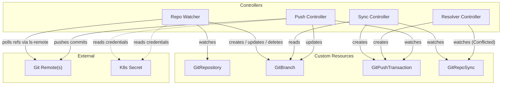
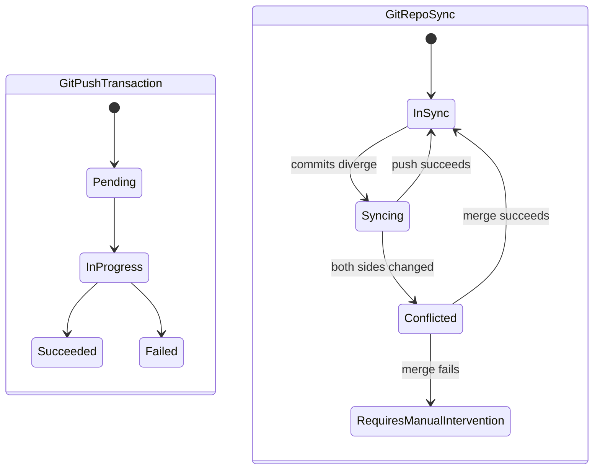
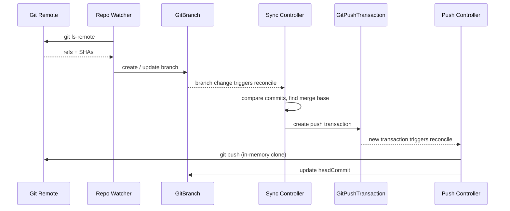

# git-k8s

Kubernetes-native controllers for declarative Git repository management. Define
Git repositories, track branches, execute atomic pushes, and keep repositories
in sync — all through Custom Resources.

## Architecture

git-k8s runs four controllers that communicate through Kubernetes resources
rather than direct APIs. Each controller is a separate deployment that watches
specific CRDs and takes action when their state changes.



### Controller responsibilities

| Controller | Watches | Creates / Mutates | Purpose |
|---|---|---|---|
| **Repo Watcher** | `GitRepository` | `GitBranch` | Polls remotes on a configurable interval, mirrors branch state into `GitBranch` resources |
| **Sync** | `GitRepoSync`, `GitBranch` | `GitPushTransaction` | Compares HEAD commits between two repos, calculates merge bases, creates push transactions to keep branches aligned |
| **Resolver** | `GitRepoSync` (Conflicted) | `GitPushTransaction` | Performs automated 3-way merge, falls back to `RequiresManualIntervention` on file-level conflicts |
| **Push** | `GitPushTransaction` | `GitBranch` | Clones into memory, executes atomic pushes with optional compare-and-swap, updates branch status |

### Resource lifecycle



### End-to-end flow



## Installation

### Prerequisites

- A Kubernetes cluster (KinD works for local development)
- [`ko`](https://ko.build) v0.15+
- `kubectl`
- Go 1.24.7+ (for building from source)

### Deploy with ko

Set `KO_DOCKER_REPO` to a registry your cluster can pull from, then apply
everything in order:

```bash
export KO_DOCKER_REPO=<your-registry>  # e.g. ghcr.io/you, kind.local

# Create namespace
kubectl create namespace git-system

# Install CRDs
kubectl apply -f config/crds/

# Install RBAC (ServiceAccount, ClusterRole, ClusterRoleBinding)
kubectl apply -f config/rbac/

# Build images and deploy all four controllers
ko apply -f config/deployments/
```

For local development with KinD, use the built-in local registry:

```bash
export KO_DOCKER_REPO=kind.local
ko apply -f config/deployments/
```

### Verify

```bash
kubectl -n git-system get pods
```

You should see four controller pods running:

```
push-controller-...       1/1   Running
sync-controller-...       1/1   Running
resolver-controller-...   1/1   Running
repo-watcher-...          1/1   Running
```

## Authentication

Controllers authenticate to Git remotes using Kubernetes Secrets referenced from
`GitRepository` resources. The Secret must exist in the same namespace as the
`GitRepository`.

### Create a Secret

For HTTPS repositories using a username and personal access token:

```bash
kubectl create secret generic my-git-creds \
  --namespace=default \
  --from-literal=username=<git-username> \
  --from-literal=password=<personal-access-token>
```

### Reference it from a GitRepository

```yaml
apiVersion: git-k8s.imjasonh.com/v1alpha1
kind: GitRepository
metadata:
  name: my-repo
  namespace: default
spec:
  url: https://github.com/example/repo.git
  defaultBranch: main
  pollInterval: 30s
  auth:
    secretRef:
      name: my-git-creds
```

The `auth` field is optional — omit it for public repositories. When present,
the Push Controller and Repo Watcher Controller both resolve the Secret to
authenticate clone, push, and ls-remote operations.

### RBAC

The controllers' ClusterRole already includes read access to Secrets:

```yaml
- apiGroups: [""]
  resources: [secrets]
  verbs: [get, list, watch]
```

No additional RBAC configuration is needed.

## Usage

### Track a repository

```yaml
apiVersion: git-k8s.imjasonh.com/v1alpha1
kind: GitRepository
metadata:
  name: upstream
spec:
  url: https://github.com/example/repo.git
  defaultBranch: main
  pollInterval: 1m
```

The Repo Watcher will poll the remote and create a `GitBranch` resource for each
branch it discovers.

### Push to a repository

```yaml
apiVersion: git-k8s.imjasonh.com/v1alpha1
kind: GitPushTransaction
metadata:
  name: push-feature
spec:
  repositoryRef: upstream
  atomic: true
  refSpecs:
    - source: abc123def
      destination: refs/heads/main
      expectedOldCommit: 789fed456   # optional CAS check
```

### Sync two repositories

```yaml
apiVersion: git-k8s.imjasonh.com/v1alpha1
kind: GitRepoSync
metadata:
  name: keep-in-sync
spec:
  repoA:
    name: upstream
  repoB:
    name: fork
  branchName: main
```

The Sync Controller will detect when the branch diverges between the two repos
and create `GitPushTransaction` resources to bring them back in sync. If both
sides have diverged, the Resolver Controller attempts an automated 3-way merge.

## Design decisions

- **Stateless controllers** — All Git operations use in-memory storage
  (`go-git` with `memory.NewStorage()`). No persistent volumes required.
- **Separate binaries** — Each controller is its own deployment. They
  communicate exclusively through Kubernetes resources.
- **Atomic pushes** — Push transactions support compare-and-swap via
  `expectedOldCommit` to prevent race conditions.
- **No finalizers** — Resource relationships use labels and owner references
  only.

## License

Apache-2.0
